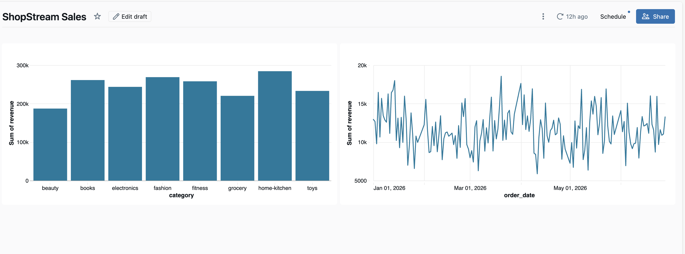
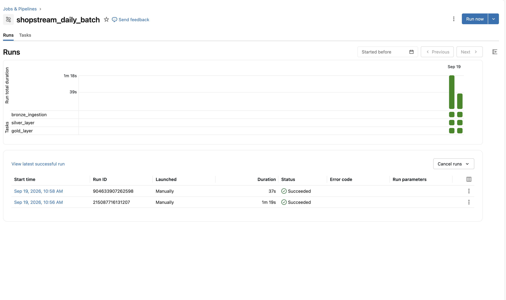
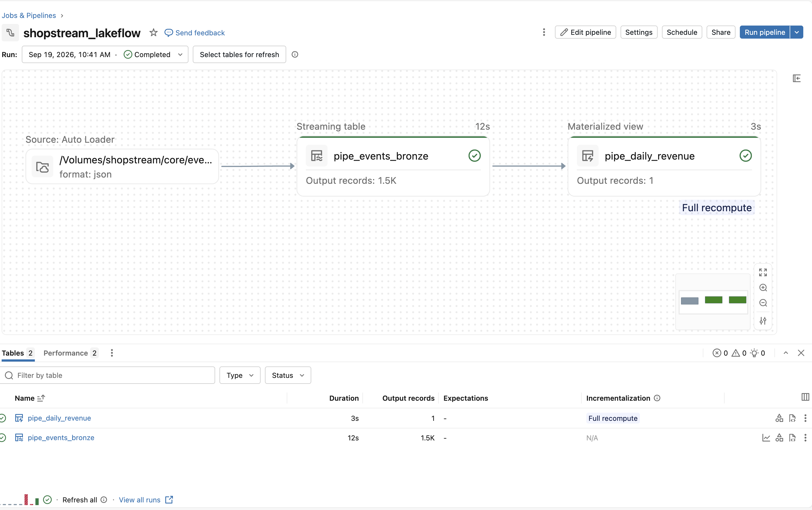
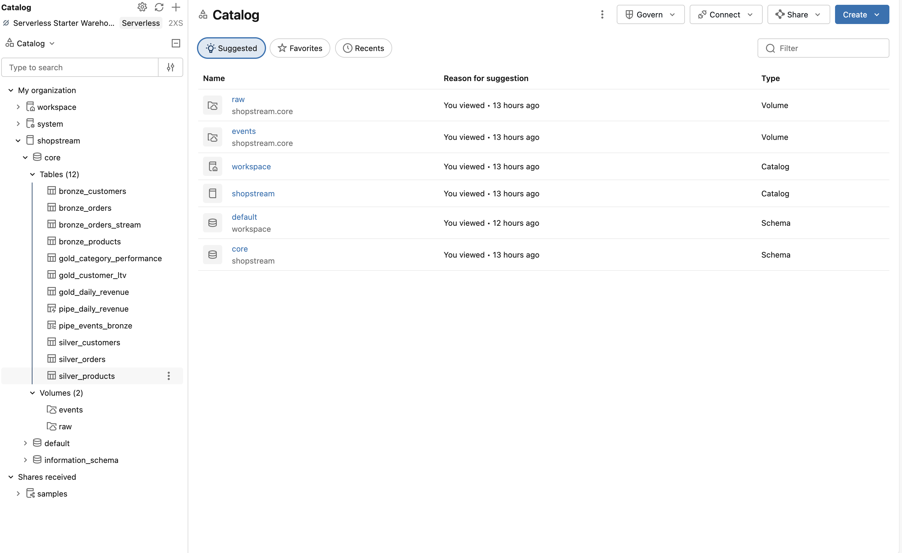

# 🛒 ShopStream — Databricks Lakehouse Data Engineering Project

A production-style **Data Engineering project built on Databricks** that demonstrates batch ingestion, data transformation, streaming ingestion, Delta Lake, Unity Catalog, Auto Loader, Lakeflow, workflow orchestration, and analytics dashboards.

The project simulates an e-commerce platform where customer, product, order, and real-time event data are processed through a **Medallion Architecture (Bronze → Silver → Gold)**.

---

## 📌 Project Overview

ShopStream is an end-to-end data engineering pipeline designed to process both historical batch data and continuously arriving order events.

The project demonstrates how raw e-commerce data can be transformed into clean, analytics-ready datasets and business insights.

### Key capabilities

* Batch data ingestion
* Data cleansing and transformation
* Medallion architecture
* Delta Lake tables
* Unity Catalog
* Real-time event ingestion
* Databricks Auto Loader
* Lakeflow pipelines
* Databricks Workflows
* SQL and PySpark transformations
* Data quality handling
* Business analytics
* Git/GitHub integration

---

## 🏗️ Architecture

```text
                         SHOPSTREAM DATA PLATFORM
                                  │
              ┌───────────────────┴───────────────────┐
              │                                       │
        Batch Data                              Streaming Data
              │                                       │
       CSV Files / Volumes                    JSON Event Files
              │                                       │
              ▼                                       ▼
       Bronze Ingestion                         Auto Loader
              │                                       │
              ▼                                       ▼
       Bronze Delta Tables                    Bronze Streaming
              │                                       │
              └───────────────────┬───────────────────┘
                                  │
                                  ▼
                         Silver Transformation
                                  │
                    Cleaning / Validation / Standardization
                                  │
                                  ▼
                           Gold Data Layer
                                  │
                    ┌─────────────┴─────────────┐
                    │                           │
             Business Metrics             Daily Revenue
                    │                           │
                    └─────────────┬─────────────┘
                                  │
                                  ▼
                         Databricks Dashboard
```

---

## 🥉 Bronze Layer

The Bronze layer stores raw data with minimal transformation.

### Batch data

The project ingests:

| Dataset   | Records |
| --------- | ------: |
| Customers |  ~1,000 |
| Products  |    ~197 |
| Orders    | ~13,717 |

The source files are stored in Databricks Unity Catalog Volumes.

```text
/Volumes/shopstream/core/raw/
```

The batch ingestion process uses Databricks SQL and `COPY INTO` to load CSV data into Delta tables.

### Bronze tables

```text
shopstream.core.bronze_orders
shopstream.core.bronze_orders_stream
```

---

## 🥈 Silver Layer

The Silver layer prepares the raw data for reliable analytics.

Typical transformations include:

* Removing invalid records
* Handling duplicate records
* Standardizing status values
* Validating quantities
* Cleaning data types
* Preparing datasets for downstream analysis

The cleaned data is then used by the Gold layer.

---

## 🥇 Gold Layer

The Gold layer contains business-ready datasets designed for analytics and reporting.

### Gold tables

```text
shopstream.core.gold_category_performance
shopstream.core.gold_daily_revenue
```

### Gold Category Performance

Provides category-level business metrics such as:

* Order activity
* Product performance
* Revenue
* Category-level comparisons

### Gold Daily Revenue

Provides daily revenue metrics for business reporting and dashboard visualization.

---

# ⚡ Streaming Data Pipeline

ShopStream also simulates a real-time order event stream.

The event generator creates JSON order events and writes them into a Databricks Volume.

```text
/Volumes/shopstream/core/events/orders_stream
```

The streaming pipeline uses **Databricks Auto Loader** to detect and ingest newly arriving files.

```text
JSON Events
     │
     ▼
Auto Loader
     │
     ▼
Bronze Streaming Table
     │
     ▼
Downstream Transformations
```

The streaming ingestion uses:

* Structured Streaming
* Auto Loader
* CloudFiles
* JSON
* Checkpointing
* Delta Lake

Checkpoint location:

```text
/Volumes/shopstream/core/events/_checkpoints/bronze_orders_stream
```

Checkpointing allows the streaming pipeline to maintain processing state and avoid reprocessing already handled files.

---

# 🔄 Lakeflow Pipeline

The project also demonstrates Databricks **Lakeflow** for pipeline-based data processing.

Pipeline:

```text
shopstream_lakeflow
```

The pipeline processes streaming events and creates analytics-ready outputs.

Example transformation:

```python
@dlt.table(
    name="pipe_daily_revenue",
    comment="Daily revenue from the live event stream"
)
def pipe_daily_revenue():
    return (
        dlt.read("pipe_events_bronze")
        .where("status = 'completed'")
        .groupBy(to_date("event_ts").alias("event_date"))
        .agg(
            expr("count(*) AS events"),
            expr("round(sum(quantity * unit_price), 2) AS revenue")
        )
    )
```

This demonstrates declarative pipeline development and incremental processing in Databricks.

---

# 🔄 Workflow Orchestration

The batch pipeline is orchestrated using a Databricks Job.

### Job

```text
shopstream_daily_batch
```

### Task dependency

```text
bronze_ingestion
       │
       ▼
silver_layer
       │
       ▼
gold_layer
```

### Tasks

| Task                  | Notebook                    | Dependency |
| --------------------- | --------------------------- | ---------- |
| Bronze Ingestion      | `01_bronze_batch_ingestion` | —          |
| Silver Transformation | `02_silver_layer`           | Bronze     |
| Gold Transformation   | `03_gold_layer`             | Silver     |

This ensures that each processing stage executes only after the previous stage completes successfully.

---

# 🗄️ Unity Catalog

The project uses **Unity Catalog** for data organization and governance.

Catalog:

```text
shopstream
```

Schema:

```text
core
```

### Project tables

```text
shopstream.core.bronze_orders
shopstream.core.bronze_orders_stream
shopstream.core.gold_category_performance
shopstream.core.gold_daily_revenue
```

### Storage locations

Raw batch data:

```text
/Volumes/shopstream/core/raw
```

Streaming events:

```text
/Volumes/shopstream/core/events
```

---

# 📊 Dashboard

The Gold-layer datasets are used to create a Databricks dashboard:

**ShopStream Sales**

The dashboard provides business-level visibility into metrics such as:

* Daily revenue
* Category performance
* Sales trends
* Order activity

---

# 📸 Project Screenshots

## ShopStream Sales Dashboard



---

## Databricks Workflow

The batch processing workflow runs in the following order:

```text
Bronze → Silver → Gold
```



---

## Lakeflow Pipeline



---

## Unity Catalog

The project data is organized under the `shopstream.core` schema.



---

# 📁 Project Structure

```text
ShopStream-Databricks-Lakehouse/
│
├── dashboard.png
├── job.png
├── lakeflow.png
├──catalog.png
│
├── 01_bronze_batch_ingestion.ipynb
├── 02_silver_layer.ipynb
├── 03_gold_layer.ipynb
├── 04_stream_events.ipynb
├── 05_streaming_bronze.ipynb
│
└── README.md
```

---

# 📓 Notebook Details

### `01_bronze_batch_ingestion.ipynb`

Handles batch ingestion of raw e-commerce datasets into the Bronze layer.

Technologies:

* Databricks SQL
* CSV
* Delta Lake
* Unity Catalog

---

### `02_silver_layer.ipynb`

Performs data cleansing and transformation.

Focus areas:

* Data quality
* Standardization
* Validation
* Transformation

---

### `03_gold_layer.ipynb`

Creates analytics-ready Gold datasets.

Outputs include:

```text
gold_category_performance
gold_daily_revenue
```

---

### `04_stream_events.ipynb`

Simulates a live order event source by generating JSON event files.

The notebook creates small batches of events and writes them into the streaming Volume.

---

### `05_streaming_bronze.ipynb`

Uses Databricks Auto Loader and Structured Streaming to ingest newly arriving JSON files into the Bronze streaming table.

---

# 🧹 Data Quality

The source data intentionally contains common real-world data quality issues such as:

* Duplicate records
* Invalid quantities
* Inconsistent status casing
* Unexpected values
* Schema inconsistencies

The pipeline demonstrates how these issues can be handled during transformation rather than assuming that source data is always clean.

---

# ⚙️ Engineering Decisions

### Why Medallion Architecture?

The Bronze → Silver → Gold approach separates raw ingestion, transformation, and business-ready data.

This makes the pipeline easier to maintain, debug, and extend.

### Why Delta Lake?

Delta tables provide reliable storage for analytical workloads and support transactional data operations.

### Why Auto Loader?

Auto Loader is suitable for continuously arriving files because it incrementally detects and processes new data instead of repeatedly scanning the entire source directory.

### Why Checkpointing?

Streaming checkpoints preserve processing state and help prevent already processed events from being unnecessarily reprocessed.

### Why Unity Catalog?

Unity Catalog provides a centralized structure for organizing and managing data assets.

### Why Workflow Orchestration?

Databricks Jobs allow the Bronze, Silver, and Gold stages to run in a controlled dependency order.

---

# 🛠️ Technologies Used

### Data Engineering

* Python
* PySpark
* SQL
* Apache Spark
* Structured Streaming

### Databricks

* Databricks
* Delta Lake
* Unity Catalog
* Auto Loader
* Lakeflow
* Databricks Workflows
* Databricks Volumes
* Databricks SQL

### Development

* Git
* GitHub
* Jupyter Notebooks

---

# 🎯 Key Data Engineering Concepts Demonstrated

This project demonstrates practical understanding of:

* ETL / ELT pipelines
* Batch processing
* Streaming processing
* Medallion architecture
* Data lakehouse architecture
* Delta tables
* Incremental data processing
* Data quality
* Schema handling
* Checkpointing
* Auto Loader
* Workflow orchestration
* Data transformation
* Business analytics
* Git-based development

---

# 🚀 How to Run the Project

### 1. Clone the repository

```bash
git clone https://github.com/bindu971/ShopStream-Databricks-Lakehouse.git
```

### 2. Open the project in Databricks

Import the notebooks into a Databricks workspace or connect the repository using Databricks Git folders.

### 3. Create the Unity Catalog structure

```text
Catalog: shopstream
Schema: core
```

### 4. Create the required Volumes

```text
/Volumes/shopstream/core/raw
/Volumes/shopstream/core/events
```

### 5. Upload the source datasets

Place the required CSV files into:

```text
/Volumes/shopstream/core/raw/
```

### 6. Run the batch pipeline

Run:

```text
01_bronze_batch_ingestion
        ↓
02_silver_layer
        ↓
03_gold_layer
```

### 7. Run the streaming pipeline

Start the event generator:

```text
04_stream_events
```

Then run:

```text
05_streaming_bronze
```

### 8. Run the Lakeflow pipeline

Start:

```text
shopstream_lakeflow
```

### 9. View the dashboard

Open:

```text
ShopStream Sales
```

---

# 📈 Project Outcome

ShopStream demonstrates an end-to-end lakehouse workflow where raw batch and streaming data are transformed into reliable, analytics-ready datasets.

The project combines:

```text
Ingestion
   ↓
Data Quality
   ↓
Transformation
   ↓
Streaming
   ↓
Orchestration
   ↓
Analytics
```

This provides hands-on experience with several technologies commonly used in modern Data Engineering environments.

---

# 📚 Learning Resources

This project was developed as part of hands-on Data Engineering learning using Databricks and related technologies.

The implementation is an independent portfolio project and is not intended to reproduce proprietary course material.

---

# 👩‍💻 Author

**Velpula Himabindu**

Data Engineering | Python | SQL | PySpark | Databricks

GitHub:
https://github.com/bindu971

---

## ⭐ Project Highlights

```text
✔ Batch ETL Pipeline
✔ Medallion Architecture
✔ Delta Lake
✔ Unity Catalog
✔ Auto Loader
✔ Structured Streaming
✔ Lakeflow
✔ Databricks Workflows
✔ Data Quality Handling
✔ Gold-Layer Analytics
✔ Databricks Dashboard
✔ GitHub Version Control
```
